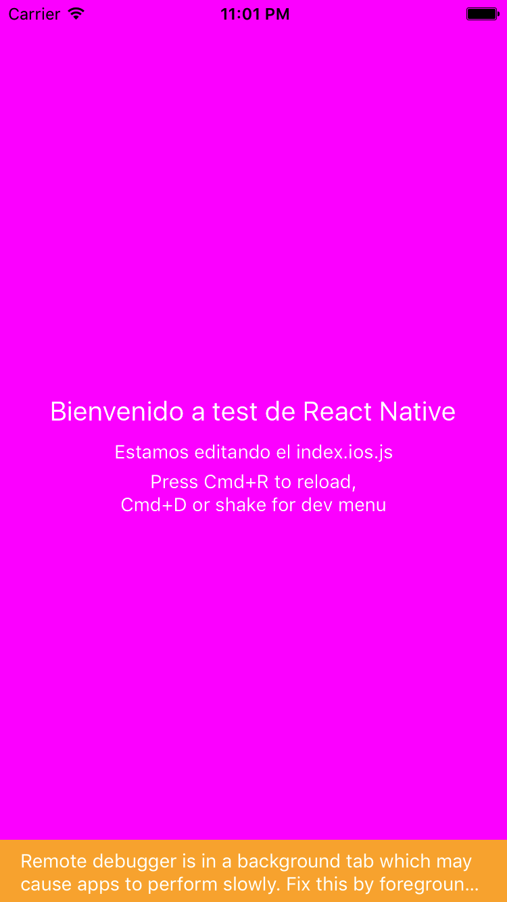

# React, React Native?
## Que es react? Es solo para web?
Es una libreria JavaScript diseñana para crear interfaces de usuario
Con cada cambio de estado se borra todo lo que sucede en la pantalla y se vuelve a dibujar toda la escena (renderizador inmediato)

Visto desde el MVC, react es V (vista)
Se puede combinar con otras librerias javaScript(AngularJS, Ember o Backbone)
* Tiene una gran comunidad dónde se compartin  extensiones

todo componente debe ser capaz de autogestionarse, debe saber cuando volver a renderizarse (cambios de estado, propiedades heredadas)

#Qué es react-Native?
Cross-platform nativa usando javascript

* No es un webView, es nativo
* No tenemos DOM, CSS
* El layout se crea con subconjunto de propiedades CSS [(LayoutProps)](https://facebook.github.io/react-native/docs/layout-props.html)
* Acceso a moludos de NPM excepto librerías que dependan del navegador o de node.js
* Es como testear JavaScript

## React native tiene algo que ver con react a secas?

# Complementos de react
gestos tactiles:

- QuoJS
- FastClick
- HammerJS

Enrutador:

- Director
- react-router
- SPArouter

# Claves de REACT
Que hace a React diferente de los demás?

- Renderiza todo con cada cambio
- Virtual DOM
- Eventos sintéticos

# Cosas que no sé:
- Programación reactiva
- Sistema data-binding
- declarative and composable
- workflof
- Observers
- Bindings
- Dirty-Checking Models(Angular)
- React funcional
- polyfills 
- shims 

# Al lio: Vamos a probar React-Native
### Environment:
* MAC
* Brew
* node

## Instalando todo:

`brew install watchman`

`npm install -g react-native-cli`

## Creando el proyecto
dentro de una carpeta arrancamos la terminal y:
`react-native init helloWorld`

Una vez se ha descargado todo

`react-native run ios`

si no funciona hay que comprobar que el servidor esté en marcha
`react-native start`

Abrimos la carpeta con nuestro editor (en nuestro caso sublimeText)

[Tutorial que vamos a seguir](https://facebook.github.io/react-native/docs/tutorial.html#content)

